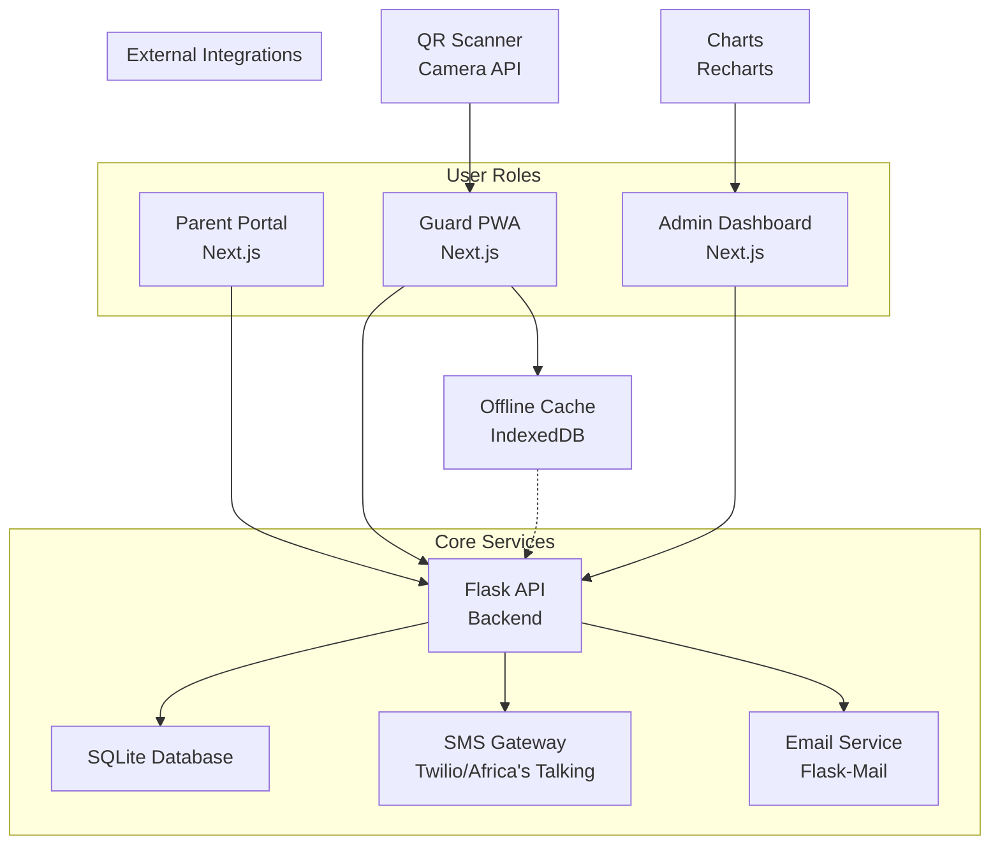

# Qreet Platform - System Architecture

## High-Level Architecture Diagram

## Component Descriptions

### Frontend Layer
- **Parent Portal**: Web interface for registration, QR management, notifications
- **Guard PWA**: Mobile-optimized app for QR scanning with offline capabilities
- **Admin Dashboard**: Analytics, logs, and system management

### Backend Layer
- **Flask API**: RESTful endpoints for all business logic
  - Authentication & authorization
  - QR generation & verification
  - Logging & notifications
  - Analytics queries

### Data Layer
- **SQLite Database**: Lightweight relational storage
  - User accounts and roles
  - Children and QR codes
  - Event logs and analytics data

### External Services
- **SMS Gateway**: For real-time notifications and offline fallback
- **Email Service**: For QR distribution and admin alerts

### Offline Capabilities
- Guard PWA caches valid QR codes in IndexedDB
- Syncs with backend when connection resumes
- SMS fallback for critical communications

## Data Flow
1. Parent registers → QR generated → Stored in DB → Distributed via email/SMS
2. Guard scans QR → API validates → Logs event → Sends notifications
3. Admin views analytics → Queries DB → Displays charts

## Security Layers
- JWT authentication for API access
- Role-based access control
- Encrypted data storage
- HTTPS for all communications